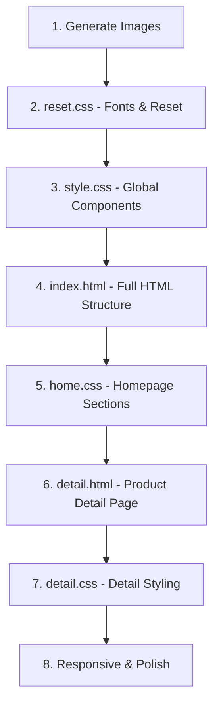

# Triển khai trang web OASIS - E-Commerce Plant Shop từ Figma

## Mô tả
Cắt giao diện từ bản thiết kế Figma "E-Commerce Plant Shop Website" thành HTML/CSS thuần. Trang web là cửa hàng cây cảnh tên **OASIS** với phong cách hiện đại, tông màu xanh lá rừng (Dark Forest Green).

## Phân tích thiết kế Figma

### Bảng màu (Color Palette)
| Tên | Hex Code | Sử dụng |
|-----|----------|---------|
| Dark Forest Green | `#1E3F20` | Logo, headings, buttons, footer background |
| Medium Green | `#3A5F43` | Checkmarks, accents |
| Muted Gray-Green | `#5F6F65` | Nav links inactive |
| Off-white / Cream | `#FAF9F6` | Page background |
| Light Cream | `#F5F7F4` | Feature cards, product cards |
| Dark Charcoal | `#333333` | Body text |
| White | `#FFFFFF` | Button text, footer text |
| Light Sage | `#A3B899` | Footer secondary links |
| Light Gray | `#D1D1D1` | Inactive pagination dots |

### Typography
- **Headings**: Serif font (e.g. `'Playfair Display'` hoặc `'Cormorant Garamond'`)
- **Body/UI**: Sans-serif font (e.g. `'Inter'` hoặc `'Poppins'`)

### Các section cần triển khai

**Trang chủ (index.html)** — 8 sections:
1. **Header/Navigation** — Logo "OASIS", nav links (Home, About Us, Product, Testimonial, Contact), icons (Search, Cart)
2. **Hero Section** — 2 cột: tiêu đề "Create your own mini oasis", mô tả, nút "Shop Now" + hình cây Monstera lớn
3. **Features Section** — 3 thẻ ngang: Quality Plants, Free Shipping, 24/7 Support
4. **About Us / Why Choose Us** — 2 cột: text + danh sách bullet points với checkmarks + grid ảnh
5. **Categories Section** — 3 category cards: Natural Plants, Plant Accessories, Artificial Plants
6. **Best Sellers Section** — 4 product cards: tên, giá, rating, nút "+"
7. **Testimonial Section** — Quote, avatar, tên khách, pagination dots + ảnh trang trí
8. **Footer** — 4 cột: Brand info + social icons, Quick Links, Categories, Contact + Newsletter

**Trang chi tiết (detail.html)** — Cần header + footer giống trang chủ + phần chi tiết sản phẩm

---

## Proposed Changes

### 1. Reset CSS
#### [MODIFY] [reset.css](file:///d:/BAITAPTHUCTAP/bai1-html-css/css/reset.css)
- Thêm Google Fonts: `Playfair Display` (serif cho headings) + `Inter` (sans-serif cho body)
- Cập nhật font-family mặc định thành `'Inter', sans-serif`
- Thêm `scroll-behavior: smooth`

---

### 2. Style CSS (Global Components)
#### [MODIFY] [style.css](file:///d:/BAITAPTHUCTAP/bai1-html-css/css/style.css)
- Cập nhật bảng màu từ blue (`#007bff`) sang green (`#1E3F20`)
- Cập nhật container `max-width: 1200px` → `1320px`
- Cập nhật header: logo text "OASIS", nav links theo Figma, search + cart icons
- Cập nhật buttons: `btn-primary` nền `#1E3F20`, border-radius, padding theo Figma
- Cập nhật footer: nền `#1E3F20`, 4 cột layout, newsletter form, social icons
- Cập nhật responsive breakpoints

---

### 3. Home CSS (Trang chủ)
#### [MODIFY] [home.css](file:///d:/BAITAPTHUCTAP/bai1-html-css/css/home.css)
- CSS cho Hero section: 2 cột layout, typography lớn cho heading
- CSS cho Features section: 3 cột cards với icon tròn
- CSS cho About Us section: 2 cột, bullet list với checkmarks
- CSS cho Categories section: 3 category cards
- CSS cho Best Sellers section: 4 product cards grid
- CSS cho Testimonial section: quote card + image

---

### 4. Detail CSS
#### [MODIFY] [detail.css](file:///d:/BAITAPTHUCTAP/bai1-html-css/css/detail.css)
- CSS cho product detail page: gallery + info layout

---

### 5. HTML — Trang chủ
#### [MODIFY] [index.html](file:///d:/BAITAPTHUCTAP/bai1-html-css/index.html)
- Viết lại hoàn toàn theo cấu trúc thiết kế Figma OASIS
- Thêm tất cả 8 sections: Header, Hero, Features, About Us, Categories, Best Sellers, Testimonial, Footer
- Sử dụng text/content từ Figma (tiếng Anh)
- Sử dụng SVG inline cho icons (search, cart, social media, checkmarks)

---

### 6. HTML — Trang chi tiết
#### [MODIFY] [detail.html](file:///d:/BAITAPTHUCTAP/bai1-html-css/detail.html)
- Viết lại thành trang HTML đầy đủ (hiện tại thiếu `<!DOCTYPE>`, `<head>`, header, footer)
- Thêm header + footer giống trang chủ
- Cập nhật product detail section

---

### 7. Ảnh — Generate placeholder images
- Tạo các ảnh AI cho: hero plant, product cards, about us, categories, testimonial
- Lưu vào `assets/images/`

---

## Thứ tự triển khai

## Verification Plan

### Manual Verification
- Mở `index.html` trong trình duyệt để kiểm tra giao diện
- So sánh với bản thiết kế Figma
- Kiểm tra responsive trên các kích thước màn hình (mobile, tablet, desktop)
- Kiểm tra navigation giữa index.html ↔ detail.html

> [!IMPORTANT]
> Vì đây là dự án HTML/CSS thuần (không có framework), tôi sẽ sử dụng SVG inline cho icons thay vì icon fonts để tránh cần cài thêm dependencies. Ảnh placeholder sẽ được tạo bằng AI.

> [!NOTE]
> Nội dung text sẽ giữ nguyên tiếng Anh theo bản Figma gốc. Bạn có muốn tôi dịch sang tiếng Việt không?
