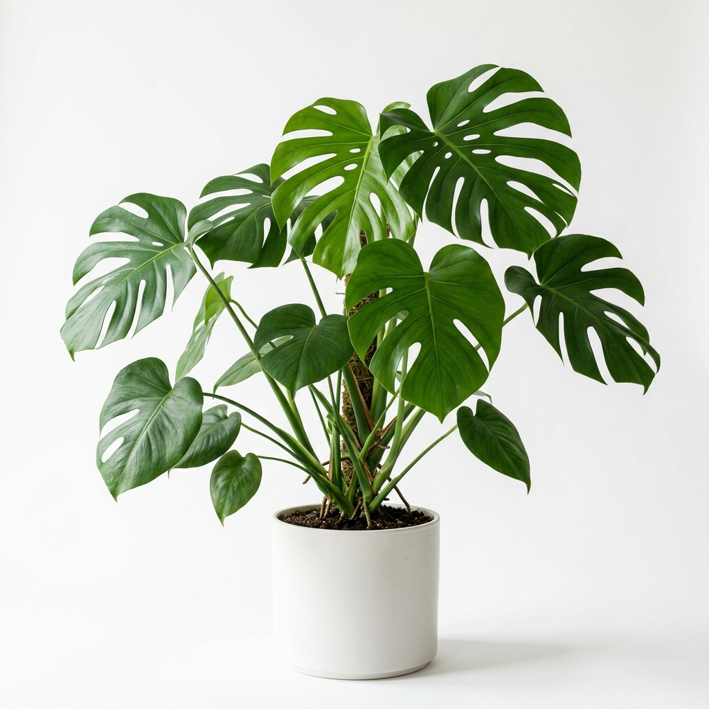
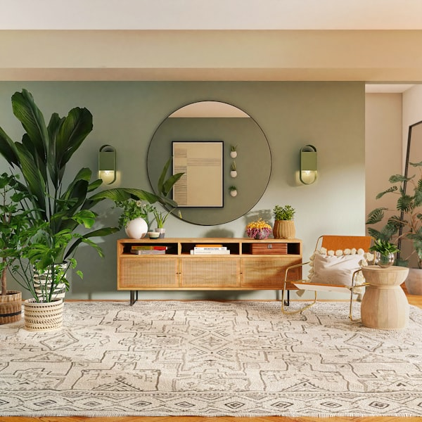
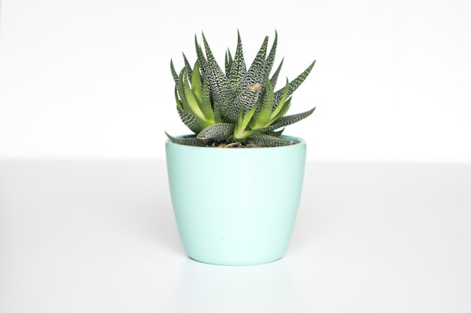
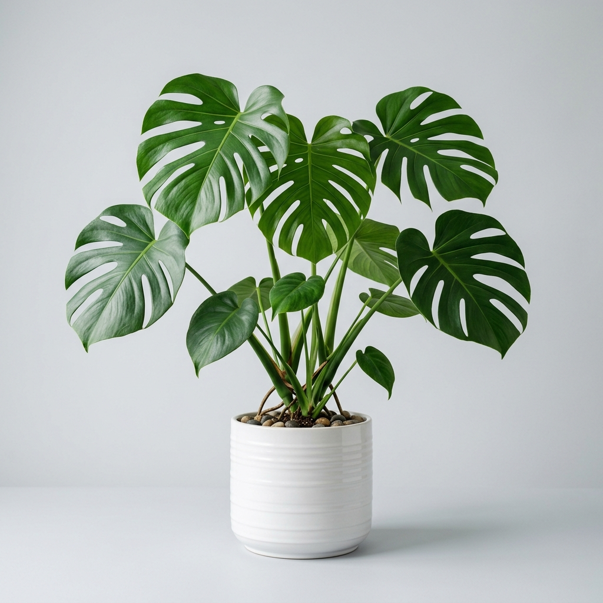
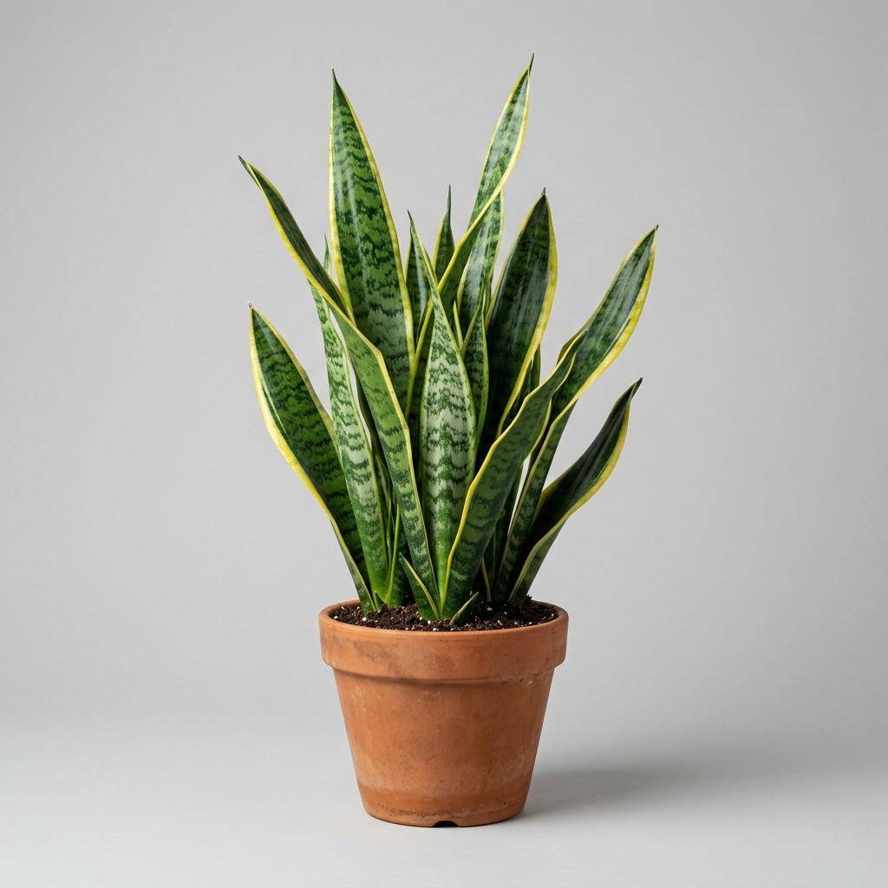
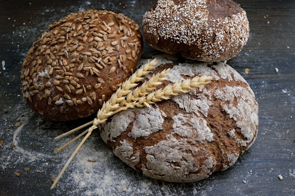

# 🌿 Hướng dẫn cắt web OASIS Plant Shop — Code chi tiết từng bước

> Bạn sẽ tự viết code. Tài liệu này cho bạn **code mẫu hoàn chỉnh** để tham khảo. Hãy **đọc hiểu** rồi tự gõ lại, đừng copy-paste — bạn sẽ học được nhiều hơn!

---

## 📁 Cấu trúc file

```
bai1-html-css/
├── css/
│   ├── reset.css      ← Bước 1
│   ├── style.css      ← Bước 2
│   ├── home.css       ← Bước 4
│   └── detail.css     ← Bước 6
├── assets/images/     ← Bước 7: Ảnh
├── index.html         ← Bước 3
└── detail.html        ← Bước 5
```

---

## 🎨 Bảng màu từ Figma

| Tên | Hex | Dùng ở đâu |
|-----|-----|-------------|
| **Dark Forest Green** | `#1E3F20` | Logo, headings, buttons chính, footer nền |
| **Medium Green** | `#3A5F43` | Checkmarks, section labels |
| **Muted Gray-Green** | `#5F6F65` | Nav links, body text phụ |
| **Off-white** | `#FAF9F6` | Nền trang |
| **Light Cream** | `#F5F7F4` | Nền cards |
| **Dark Charcoal** | `#333333` | Chữ body |
| **White** | `#FFFFFF` | Text trên nền tối, button text |
| **Light Sage** | `#A3B899` | Footer links phụ |
| **Gold** | `#FFD700` | Rating stars |

---

## 📝 Bước 1: reset.css

**Mục tiêu**: Reset CSS mặc định trình duyệt + import Google Fonts.

```css
/* ===== GOOGLE FONTS ===== */
@import url('https://fonts.googleapis.com/css2?family=Inter:wght@300;400;500;600&family=Playfair+Display:wght@400;500;600;700&display=swap');

/* ===== RESET MẶC ĐỊNH ===== */
* {
    margin: 0;
    padding: 0;
    box-sizing: border-box;
}

html {
    scroll-behavior: smooth;
}

html, body {
    font-family: 'Inter', sans-serif;
    line-height: 1.6;
    color: #333333;
    background-color: #FAF9F6;
}

img {
    max-width: 100%;
    display: block;
}

a {
    text-decoration: none;
    color: inherit;
}

ul, li {
    list-style: none;
}

button {
    border: none;
    outline: none;
    cursor: pointer;
    font-family: inherit;
}
```

> [!NOTE]
> `@import` Google Fonts phải nằm ở **dòng đầu tiên** của file CSS, trước tất cả code khác.

---

## 📝 Bước 2: style.css — Components dùng chung

**Mục tiêu**: CSS cho header, footer, buttons, container — dùng ở cả 2 trang.

```css
/* ============================================
   STYLE.CSS - Components dùng chung
   ============================================ */

/* ===== CONTAINER ===== */
.container {
    max-width: 1320px;
    margin: 0 auto;
    padding: 0 20px;
}

/* ===== SECTION TITLE (dùng lại nhiều lần) ===== */
.section-label {
    display: block;
    text-transform: uppercase;
    font-size: 14px;
    color: #3A5F43;
    letter-spacing: 2px;
    font-weight: 600;
    margin-bottom: 10px;
}

.section-title {
    font-family: 'Playfair Display', serif;
    font-size: 40px;
    color: #1E3F20;
    line-height: 1.3;
}

/* ===== BUTTONS ===== */
.btn {
    display: inline-block;
    padding: 14px 32px;
    border-radius: 8px;
    font-weight: 600;
    font-size: 16px;
    transition: all 0.3s ease;
    cursor: pointer;
    border: none;
}

.btn-primary {
    background-color: #1E3F20;
    color: #fff;
}

.btn-primary:hover {
    background-color: #2d5a30;
}

.btn-outline {
    background-color: transparent;
    border: 2px solid #1E3F20;
    color: #1E3F20;
}

.btn-outline:hover {
    background-color: #1E3F20;
    color: #fff;
}

/* ===== HEADER ===== */
.header {
    background-color: #fff;
    position: sticky;
    top: 0;
    z-index: 100;
    box-shadow: 0 1px 3px rgba(0, 0, 0, 0.05);
}

.header .container {
    display: flex;
    justify-content: space-between;
    align-items: center;
    height: 80px;
}

/* Logo */
.logo {
    font-family: 'Playfair Display', serif;
    font-size: 28px;
    font-weight: 700;
    color: #1E3F20;
}

/* Navigation */
.navbar ul {
    display: flex;
    gap: 35px;
}

.navbar a {
    font-size: 15px;
    color: #5F6F65;
    font-weight: 500;
    transition: color 0.3s ease;
    position: relative;
}

.navbar a:hover,
.navbar a.active {
    color: #1E3F20;
}

/* Gạch dưới khi hover/active */
.navbar a.active::after {
    content: '';
    position: absolute;
    bottom: -5px;
    left: 0;
    width: 100%;
    height: 2px;
    background-color: #1E3F20;
}

/* Header Icons (Search, Cart) */
.header-icons {
    display: flex;
    gap: 20px;
    align-items: center;
}

.header-icons a {
    color: #1E3F20;
    transition: opacity 0.3s;
}

.header-icons a:hover {
    opacity: 0.7;
}

.header-icons svg {
    width: 22px;
    height: 22px;
}

/* ===== FOOTER ===== */
.footer {
    background-color: #1E3F20;
    color: #fff;
    padding: 80px 0 30px;
}

.footer-grid {
    display: grid;
    grid-template-columns: 2fr 1fr 1fr 2fr;
    gap: 40px;
}

/* Footer - Logo & mô tả */
.footer-brand .footer-logo {
    font-family: 'Playfair Display', serif;
    font-size: 24px;
    font-weight: 700;
    margin-bottom: 15px;
}

.footer-brand p {
    color: #A3B899;
    font-size: 14px;
    line-height: 1.8;
    margin-bottom: 20px;
}

/* Footer - Social Icons */
.social-icons {
    display: flex;
    gap: 15px;
}

.social-icons a {
    display: flex;
    align-items: center;
    justify-content: center;
    width: 40px;
    height: 40px;
    border-radius: 50%;
    background-color: rgba(255, 255, 255, 0.1);
    color: #fff;
    transition: background-color 0.3s;
}

.social-icons a:hover {
    background-color: rgba(255, 255, 255, 0.25);
}

.social-icons svg {
    width: 18px;
    height: 18px;
}

/* Footer - Links */
.footer-links h3 {
    font-family: 'Playfair Display', serif;
    font-size: 18px;
    margin-bottom: 20px;
}

.footer-links ul {
    display: flex;
    flex-direction: column;
    gap: 12px;
}

.footer-links a {
    color: #A3B899;
    font-size: 14px;
    transition: color 0.3s;
}

.footer-links a:hover {
    color: #fff;
}

/* Footer - Newsletter */
.footer-newsletter h3 {
    font-family: 'Playfair Display', serif;
    font-size: 18px;
    margin-bottom: 20px;
}

.footer-newsletter p {
    color: #A3B899;
    font-size: 14px;
    margin-bottom: 20px;
}

.newsletter-form {
    display: flex;
    gap: 10px;
    margin-bottom: 25px;
}

.newsletter-form input {
    flex: 1;
    padding: 12px 16px;
    background-color: rgba(255, 255, 255, 0.1);
    border: none;
    border-radius: 8px;
    color: #fff;
    font-size: 14px;
    font-family: 'Inter', sans-serif;
}

.newsletter-form input::placeholder {
    color: #A3B899;
}

.newsletter-form button {
    padding: 12px 24px;
    background-color: #fff;
    color: #1E3F20;
    border-radius: 8px;
    font-weight: 600;
    font-size: 14px;
    transition: opacity 0.3s;
}

.newsletter-form button:hover {
    opacity: 0.9;
}

.contact-info {
    display: flex;
    flex-direction: column;
    gap: 10px;
}

.contact-info span {
    color: #A3B899;
    font-size: 14px;
}

/* Footer Bottom */
.footer-bottom {
    border-top: 1px solid rgba(255, 255, 255, 0.1);
    margin-top: 40px;
    padding-top: 20px;
    text-align: center;
    color: #A3B899;
    font-size: 13px;
}

/* ===== RESPONSIVE ===== */

/* Tablet */
@media (max-width: 992px) {
    .header .container {
        height: auto;
        padding: 15px 20px;
        flex-wrap: wrap;
    }

    .navbar ul {
        gap: 20px;
    }

    .footer-grid {
        grid-template-columns: 1fr 1fr;
        gap: 30px;
    }

    .section-title {
        font-size: 32px;
    }
}

/* Mobile */
@media (max-width: 768px) {
    .header .container {
        flex-direction: column;
        gap: 15px;
    }

    .navbar ul {
        flex-direction: column;
        gap: 10px;
        text-align: center;
    }

    .header-icons {
        display: none; /* Ẩn trên mobile, hoặc bạn có thể hiện */
    }

    .footer-grid {
        grid-template-columns: 1fr;
    }

    .section-title {
        font-size: 28px;
    }

    .newsletter-form {
        flex-direction: column;
    }
}
```

> [!TIP]
> **Giải thích `position: sticky`**: Header sẽ dính ở đầu trang khi bạn cuộn xuống. Cần `top: 0` và `z-index` để nó nằm trên các phần tử khác.

---

## 📝 Bước 3: index.html — HTML trang chủ

**Mục tiêu**: Viết đầy đủ cấu trúc HTML cho 8 sections.

```html
<!DOCTYPE html>
<html lang="en">

<head>
    <meta charset="UTF-8">
    <meta name="viewport" content="width=device-width, initial-scale=1.0">
    <title>OASIS - Plant Shop</title>
    <link rel="stylesheet" href="css/reset.css">
    <link rel="stylesheet" href="css/style.css">
    <link rel="stylesheet" href="css/home.css">
</head>

<body>

    <!-- ===== HEADER ===== -->
    <header class="header">
        <div class="container">
            <a href="index.html" class="logo">OASIS</a>
            <nav class="navbar">
                <ul>
                    <li><a href="index.html" class="active">Home</a></li>
                    <li><a href="#">About Us</a></li>
                    <li><a href="#">Product</a></li>
                    <li><a href="#">Testimonial</a></li>
                    <li><a href="#">Contact</a></li>
                </ul>
            </nav>
            <div class="header-icons">
                <!-- Icon Search -->
                <a href="#">
                    <svg xmlns="http://www.w3.org/2000/svg" fill="none" viewBox="0 0 24 24" stroke-width="2"
                        stroke="currentColor">
                        <path stroke-linecap="round" stroke-linejoin="round"
                            d="M21 21l-5.197-5.197m0 0A7.5 7.5 0 105.196 5.196a7.5 7.5 0 0010.607 10.607z" />
                    </svg>
                </a>
                <!-- Icon Cart -->
                <a href="#">
                    <svg xmlns="http://www.w3.org/2000/svg" fill="none" viewBox="0 0 24 24" stroke-width="2"
                        stroke="currentColor">
                        <path stroke-linecap="round" stroke-linejoin="round"
                            d="M15.75 10.5V6a3.75 3.75 0 10-7.5 0v4.5m11.356-1.993l1.263 12c.07.665-.45 1.243-1.119 1.243H4.25a1.125 1.125 0 01-1.12-1.243l1.264-12A1.125 1.125 0 015.513 7.5h12.974c.576 0 1.059.435 1.119 1.007zM8.625 10.5a.375.375 0 11-.75 0 .375.375 0 01.75 0zm7.5 0a.375.375 0 11-.75 0 .375.375 0 01.75 0z" />
                    </svg>
                </a>
            </div>
        </div>
    </header>

    <!-- ===== HERO SECTION ===== -->
    <section class="hero">
        <div class="container">
            <div class="hero-content">
                <h1>Create your own<br>mini <span class="highlight">oasis</span></h1>
                <p>We offer a wide range of plants to help you create your own green space. Find the perfect plant for
                    your home or office.</p>
                <a href="detail.html" class="btn btn-primary">Shop Now</a>
            </div>
            <div class="hero-image">
                
            </div>
        </div>
    </section>

    <!-- ===== FEATURES SECTION ===== -->
    <section class="features">
        <div class="container">
            <div class="features-grid">
                <!-- Feature 1 -->
                <div class="feature-card">
                    <div class="feature-icon">
                        <!-- Icon cây lá -->
                        <svg xmlns="http://www.w3.org/2000/svg" width="28" height="28" fill="white"
                            viewBox="0 0 256 256">
                            <path
                                d="M128,188a12,12,0,0,1-12,12H96a12,12,0,0,1,0-24h20A12,12,0,0,1,128,188Zm72-92a91.84,91.84,0,0,1-2.34,20.64C190.53,84.71,161.89,60,128,60S65.47,84.71,58.34,116.64A91.84,91.84,0,0,1,56,96,72,72,0,0,1,200,96Zm-24,0a48,48,0,0,0-96,0c0,44.18,48,84,48,84S176,140.18,176,96Z" />
                        </svg>
                    </div>
                    <h3>Large Assortment</h3>
                    <p>We offer many different types of products with fewer variations in each category.</p>
                </div>
                <!-- Feature 2 -->
                <div class="feature-card">
                    <div class="feature-icon">
                        <!-- Icon xe tải -->
                        <svg xmlns="http://www.w3.org/2000/svg" width="28" height="28" fill="white"
                            viewBox="0 0 24 24">
                            <path
                                d="M20 8h-3V4H3c-1.1 0-2 .9-2 2v11h2c0 1.66 1.34 3 3 3s3-1.34 3-3h6c0 1.66 1.34 3 3 3s3-1.34 3-3h2v-5l-3-4zM6 18.5c-.83 0-1.5-.67-1.5-1.5s.67-1.5 1.5-1.5 1.5.67 1.5 1.5-.67 1.5-1.5 1.5zm13.5-9l1.96 2.5H17V9.5h2.5zm-1.5 9c-.83 0-1.5-.67-1.5-1.5s.67-1.5 1.5-1.5 1.5.67 1.5 1.5-.67 1.5-1.5 1.5z" />
                        </svg>
                    </div>
                    <h3>Free Shipping</h3>
                    <p>We offer free shipping on all orders over $50. No questions asked!</p>
                </div>
                <!-- Feature 3 -->
                <div class="feature-card">
                    <div class="feature-icon">
                        <!-- Icon headset -->
                        <svg xmlns="http://www.w3.org/2000/svg" width="28" height="28" fill="white"
                            viewBox="0 0 24 24">
                            <path
                                d="M12 1c-4.97 0-9 4.03-9 9v7c0 1.66 1.34 3 3 3h3v-8H5v-2c0-3.87 3.13-7 7-7s7 3.13 7 7v2h-4v8h3c1.66 0 3-1.34 3-3v-7c0-4.97-4.03-9-9-9z" />
                        </svg>
                    </div>
                    <h3>24/7 Support</h3>
                    <p>Our support team is available around the clock to answer your questions.</p>
                </div>
            </div>
        </div>
    </section>

    <!-- ===== ABOUT US SECTION ===== -->
    <section class="about">
        <div class="container">
            <div class="about-content">
                <span class="section-label">About Us</span>
                <h2 class="section-title">We Design Beautiful &amp; Unique Spaces</h2>
                <p class="about-desc">We are a team of passionate plant lovers dedicated to helping you find the perfect
                    plant for every space. Our experts carefully curate each collection.</p>
                <ul class="about-list">
                    <li>Handpicked healthy plants</li>
                    <li>Expert plant styling advice</li>
                    <li>Guaranteed freshness on delivery</li>
                    <li>Wide variety of rare species</li>
                </ul>
                <a href="#" class="btn btn-outline">Learn More</a>
            </div>
            <div class="about-images">
                <div class="about-img-grid">
                    
                    
                </div>
            </div>
        </div>
    </section>

    <!-- ===== CATEGORIES SECTION ===== -->
    <section class="categories">
        <div class="container">
            <div class="categories-header">
                <span class="section-label">Categories</span>
                <h2 class="section-title">Find what you are looking for</h2>
            </div>
            <div class="categories-grid">
                <div class="category-card">
                    
                    <div class="category-overlay">
                        <h3>Natural Plants</h3>
                    </div>
                </div>
                <div class="category-card">
                    
                    <div class="category-overlay">
                        <h3>Plant Accessories</h3>
                    </div>
                </div>
                <div class="category-card">
                    
                    <div class="category-overlay">
                        <h3>Artificial Plants</h3>
                    </div>
                </div>
            </div>
        </div>
    </section>

    <!-- ===== BEST SELLERS SECTION ===== -->
    <section class="best-sellers">
        <div class="container">
            <div class="best-sellers-header">
                <span class="section-label">Best Sellers</span>
                <h2 class="section-title">Our Best Sellers</h2>
            </div>
            <div class="products-grid">
                <!-- Product 1 -->
                <div class="product-card">
                    <div class="product-image">
                        
                    </div>
                    <div class="product-info">
                        <h3>Monstera Deliciosa</h3>
                        <div class="product-rating">
                            <span class="stars">★★★★★</span>
                            <span class="rating-count">(5.0)</span>
                        </div>
                        <div class="product-price-row">
                            <span class="price">$25.00</span>
                            <button class="add-to-cart">+</button>
                        </div>
                    </div>
                </div>
                <!-- Product 2 -->
                <div class="product-card">
                    <div class="product-image">
                        
                    </div>
                    <div class="product-info">
                        <h3>Snake Plant</h3>
                        <div class="product-rating">
                            <span class="stars">★★★★★</span>
                            <span class="rating-count">(4.9)</span>
                        </div>
                        <div class="product-price-row">
                            <span class="price">$18.00</span>
                            <button class="add-to-cart">+</button>
                        </div>
                    </div>
                </div>
                <!-- Product 3 -->
                <div class="product-card">
                    <div class="product-image">
                        
                    </div>
                    <div class="product-info">
                        <h3>Fiddle Leaf Fig</h3>
                        <div class="product-rating">
                            <span class="stars">★★★★★</span>
                            <span class="rating-count">(4.8)</span>
                        </div>
                        <div class="product-price-row">
                            <span class="price">$35.00</span>
                            <button class="add-to-cart">+</button>
                        </div>
                    </div>
                </div>
                <!-- Product 4 -->
                <div class="product-card">
                    <div class="product-image">
                        
                    </div>
                    <div class="product-info">
                        <h3>Aloe Vera</h3>
                        <div class="product-rating">
                            <span class="stars">★★★★★</span>
                            <span class="rating-count">(4.7)</span>
                        </div>
                        <div class="product-price-row">
                            <span class="price">$15.00</span>
                            <button class="add-to-cart">+</button>
                        </div>
                    </div>
                </div>
            </div>
        </div>
    </section>

    <!-- ===== TESTIMONIAL SECTION ===== -->
    <section class="testimonial">
        <div class="container">
            <div class="testimonial-content">
                <span class="section-label">Testimonial</span>
                <h2 class="section-title">What Our Customers Say</h2>
                <div class="testimonial-card">
                    <div class="stars">★★★★★</div>
                    <p class="quote">"I absolutely love the plants I ordered from Oasis! They arrived fresh and healthy.
                        The packaging was careful and eco-friendly. Highly recommend to anyone looking to add some
                        greenery to their space!"</p>
                    <div class="testimonial-author">
                        
                        <div>
                            <h4>Sarah M.</h4>
                            <span>Happy Customer</span>
                        </div>
                    </div>
                </div>
                <div class="testimonial-dots">
                    <span class="dot active"></span>
                    <span class="dot"></span>
                    <span class="dot"></span>
                </div>
            </div>
            <div class="testimonial-image">
                
            </div>
        </div>
    </section>

    <!-- ===== FOOTER ===== -->
    <footer class="footer">
        <div class="container">
            <div class="footer-grid">
                <!-- Cột 1: Brand -->
                <div class="footer-brand">
                    <div class="footer-logo">OASIS</div>
                    <p>Your one-stop shop for premium indoor and outdoor plants. We bring nature closer to you.</p>
                    <div class="social-icons">
                        <a href="#">
                            <!-- Facebook -->
                            <svg xmlns="http://www.w3.org/2000/svg" width="18" height="18" fill="currentColor"
                                viewBox="0 0 24 24">
                                <path
                                    d="M9 8h-3v4h3v12h5v-12h3.642l.358-4h-4v-1.667c0-.955.192-1.333 1.115-1.333h2.885v-5h-3.808c-3.596 0-5.192 1.583-5.192 4.615v3.385z" />
                            </svg>
                        </a>
                        <a href="#">
                            <!-- Instagram -->
                            <svg xmlns="http://www.w3.org/2000/svg" width="18" height="18" fill="currentColor"
                                viewBox="0 0 24 24">
                                <path
                                    d="M12 2.163c3.204 0 3.584.012 4.85.07 3.252.148 4.771 1.691 4.919 4.919.058 1.265.069 1.645.069 4.849 0 3.205-.012 3.584-.069 4.849-.149 3.225-1.664 4.771-4.919 4.919-1.266.058-1.644.07-4.85.07-3.204 0-3.584-.012-4.849-.07-3.26-.149-4.771-1.699-4.919-4.92-.058-1.265-.07-1.644-.07-4.849 0-3.204.013-3.583.07-4.849.149-3.227 1.664-4.771 4.919-4.919 1.266-.057 1.645-.069 4.849-.069zm0-2.163c-3.259 0-3.667.014-4.947.072-4.358.2-6.78 2.618-6.98 6.98-.059 1.281-.073 1.689-.073 4.948 0 3.259.014 3.668.072 4.948.2 4.358 2.618 6.78 6.98 6.98 1.281.058 1.689.072 4.948.072 3.259 0 3.668-.014 4.948-.072 4.354-.2 6.782-2.618 6.979-6.98.059-1.28.073-1.689.073-4.948 0-3.259-.014-3.667-.072-4.947-.196-4.354-2.617-6.78-6.979-6.98-1.281-.059-1.69-.073-4.949-.073zm0 5.838c-3.403 0-6.162 2.759-6.162 6.162s2.759 6.163 6.162 6.163 6.162-2.759 6.162-6.163c0-3.403-2.759-6.162-6.162-6.162zm0 10.162c-2.209 0-4-1.79-4-4 0-2.209 1.791-4 4-4s4 1.791 4 4c0 2.21-1.791 4-4 4zm6.406-11.845c-.796 0-1.441.645-1.441 1.44s.645 1.44 1.441 1.44c.795 0 1.439-.645 1.439-1.44s-.644-1.44-1.439-1.44z" />
                            </svg>
                        </a>
                        <a href="#">
                            <!-- Twitter/X -->
                            <svg xmlns="http://www.w3.org/2000/svg" width="18" height="18" fill="currentColor"
                                viewBox="0 0 24 24">
                                <path
                                    d="M24 4.557c-.883.392-1.832.656-2.828.775 1.017-.609 1.798-1.574 2.165-2.724-.951.564-2.005.974-3.127 1.195-.897-.957-2.178-1.555-3.594-1.555-3.179 0-5.515 2.966-4.797 6.045-4.091-.205-7.719-2.165-10.148-5.144-1.29 2.213-.669 5.108 1.523 6.574-.806-.026-1.566-.247-2.229-.616-.054 2.281 1.581 4.415 3.949 4.89-.693.188-1.452.232-2.224.084.626 1.956 2.444 3.379 4.6 3.419-2.07 1.623-4.678 2.348-7.29 2.04 2.179 1.397 4.768 2.212 7.548 2.212 9.142 0 14.307-7.721 13.995-14.646.962-.695 1.797-1.562 2.457-2.549z" />
                            </svg>
                        </a>
                        <a href="#">
                            <!-- YouTube -->
                            <svg xmlns="http://www.w3.org/2000/svg" width="18" height="18" fill="currentColor"
                                viewBox="0 0 24 24">
                                <path
                                    d="M19.615 3.184c-3.604-.246-11.631-.245-15.23 0-3.897.266-4.356 2.62-4.385 8.816.029 6.185.484 8.549 4.385 8.816 3.6.245 11.626.246 15.23 0 3.897-.266 4.356-2.62 4.385-8.816-.029-6.185-.484-8.549-4.385-8.816zm-10.615 12.816v-8l8 3.993-8 4.007z" />
                            </svg>
                        </a>
                    </div>
                </div>

                <!-- Cột 2: Quick Links -->
                <div class="footer-links">
                    <h3>Quick Links</h3>
                    <ul>
                        <li><a href="#">Home</a></li>
                        <li><a href="#">About Us</a></li>
                        <li><a href="#">Products</a></li>
                        <li><a href="#">Testimonial</a></li>
                        <li><a href="#">Contact</a></li>
                    </ul>
                </div>

                <!-- Cột 3: Categories -->
                <div class="footer-links">
                    <h3>Categories</h3>
                    <ul>
                        <li><a href="#">Indoor Plants</a></li>
                        <li><a href="#">Outdoor Plants</a></li>
                        <li><a href="#">Flowering Plants</a></li>
                        <li><a href="#">Office Plants</a></li>
                    </ul>
                </div>

                <!-- Cột 4: Newsletter -->
                <div class="footer-newsletter">
                    <h3>Subscribe to Newsletter</h3>
                    <p>Get the latest news and updates about our plants and special offers.</p>
                    <form class="newsletter-form">
                        <input type="email" placeholder="Enter your email">
                        <button type="submit">Subscribe</button>
                    </form>
                    <div class="contact-info">
                        <span>📞 +1 (234) 567-8901</span>
                        <span>✉️ hello@oasis.com</span>
                        <span>📍 123 Green Street, NY</span>
                    </div>
                </div>
            </div>

            <div class="footer-bottom">
                <p>&copy; 2026 OASIS. All rights reserved.</p>
            </div>
        </div>
    </footer>

</body>

</html>
```

> [!IMPORTANT]
> **Về SVG icons**: Tôi dùng SVG inline để không cần cài thêm thư viện. Nếu bạn muốn đơn giản hơn, có thể thay bằng emoji (🔍, 🛒) hoặc text.

---

## 📝 Bước 4: home.css — CSS cho trang chủ

**Mục tiêu**: CSS riêng cho tất cả sections trên trang chủ.

```css
/* ============================================
   HOME.CSS - CSS riêng cho trang chủ
   ============================================ */

/* ===== HERO SECTION ===== */
.hero {
    padding: 60px 0 80px;
}

.hero .container {
    display: flex;
    align-items: center;
    gap: 60px;
}

.hero-content {
    flex: 1;
}

.hero-content h1 {
    font-family: 'Playfair Display', serif;
    font-size: 56px;
    color: #1E3F20;
    line-height: 1.2;
    margin-bottom: 20px;
}

/* Chữ "oasis" in nghiêng hoặc màu khác */
.hero-content h1 .highlight {
    font-style: italic;
}

.hero-content p {
    font-size: 17px;
    color: #5F6F65;
    line-height: 1.8;
    margin-bottom: 35px;
    max-width: 480px;
}

.hero-image {
    flex: 1;
    display: flex;
    justify-content: flex-end;
}

.hero-image img {
    max-height: 550px;
    object-fit: contain;
}

/* ===== FEATURES SECTION ===== */
.features {
    padding: 60px 0;
    background-color: #fff;
}

.features-grid {
    display: grid;
    grid-template-columns: repeat(3, 1fr);
    gap: 30px;
}

.feature-card {
    text-align: center;
    padding: 40px 30px;
    background-color: #F5F7F4;
    border-radius: 16px;
    transition: transform 0.3s ease;
}

.feature-card:hover {
    transform: translateY(-5px);
}

.feature-icon {
    width: 64px;
    height: 64px;
    background-color: #1E3F20;
    border-radius: 50%;
    display: flex;
    align-items: center;
    justify-content: center;
    margin: 0 auto 20px;
}

.feature-card h3 {
    font-family: 'Playfair Display', serif;
    font-size: 20px;
    color: #1E3F20;
    margin-bottom: 12px;
}

.feature-card p {
    color: #5F6F65;
    font-size: 15px;
    line-height: 1.7;
}

/* ===== ABOUT US SECTION ===== */
.about {
    padding: 100px 0;
}

.about .container {
    display: flex;
    align-items: center;
    gap: 60px;
}

.about-content {
    flex: 1;
}

.about-desc {
    color: #5F6F65;
    font-size: 16px;
    line-height: 1.8;
    margin: 20px 0 25px;
}

.about-list {
    margin-bottom: 30px;
}

.about-list li {
    padding: 10px 0;
    padding-left: 30px;
    position: relative;
    color: #333;
    font-size: 15px;
}

/* Checkmark trước mỗi bullet */
.about-list li::before {
    content: '✓';
    position: absolute;
    left: 0;
    color: #3A5F43;
    font-weight: bold;
    font-size: 16px;
}

.about-images {
    flex: 1;
}

.about-img-grid {
    display: grid;
    grid-template-columns: 1fr 1fr;
    gap: 15px;
}

.about-img-grid img {
    width: 100%;
    border-radius: 16px;
    object-fit: cover;
}

.about-img-large {
    height: 350px;
}

.about-img-small {
    height: 350px;
}

/* ===== CATEGORIES SECTION ===== */
.categories {
    padding: 80px 0;
}

.categories-header {
    text-align: center;
    margin-bottom: 40px;
}

.categories-grid {
    display: grid;
    grid-template-columns: repeat(3, 1fr);
    gap: 30px;
}

.category-card {
    position: relative;
    border-radius: 16px;
    overflow: hidden;
    cursor: pointer;
    transition: transform 0.3s ease;
}

.category-card:hover {
    transform: translateY(-8px);
}

.category-card img {
    width: 100%;
    height: 320px;
    object-fit: cover;
    transition: transform 0.3s ease;
}

.category-card:hover img {
    transform: scale(1.05);
}

/* Overlay tối ở dưới ảnh + text */
.category-overlay {
    position: absolute;
    bottom: 0;
    left: 0;
    right: 0;
    padding: 20px;
    background: linear-gradient(transparent, rgba(0, 0, 0, 0.6));
}

.category-overlay h3 {
    color: #fff;
    font-family: 'Playfair Display', serif;
    font-size: 22px;
}

/* ===== BEST SELLERS SECTION ===== */
.best-sellers {
    padding: 80px 0;
    background-color: #fff;
}

.best-sellers-header {
    text-align: center;
    margin-bottom: 40px;
}

.products-grid {
    display: grid;
    grid-template-columns: repeat(4, 1fr);
    gap: 25px;
}

.product-card {
    background-color: #F5F7F4;
    border-radius: 16px;
    overflow: hidden;
    transition: transform 0.3s ease, box-shadow 0.3s ease;
}

.product-card:hover {
    transform: translateY(-5px);
    box-shadow: 0 10px 30px rgba(0, 0, 0, 0.1);
}

.product-image {
    padding: 25px;
    display: flex;
    align-items: center;
    justify-content: center;
}

.product-image img {
    height: 200px;
    object-fit: contain;
}

.product-info {
    padding: 0 20px 20px;
}

.product-info h3 {
    font-size: 16px;
    font-weight: 600;
    color: #1E3F20;
    margin-bottom: 8px;
}

.product-rating {
    margin-bottom: 10px;
}

.product-rating .stars {
    color: #FFD700;
    font-size: 14px;
}

.product-rating .rating-count {
    color: #5F6F65;
    font-size: 13px;
    margin-left: 5px;
}

.product-price-row {
    display: flex;
    justify-content: space-between;
    align-items: center;
}

.price {
    font-weight: 700;
    font-size: 18px;
    color: #1E3F20;
}

.add-to-cart {
    width: 36px;
    height: 36px;
    border-radius: 50%;
    background-color: #1E3F20;
    color: #fff;
    font-size: 20px;
    display: flex;
    align-items: center;
    justify-content: center;
    transition: background-color 0.3s ease;
}

.add-to-cart:hover {
    background-color: #2d5a30;
}

/* ===== TESTIMONIAL SECTION ===== */
.testimonial {
    padding: 100px 0;
    background-color: #F5F7F4;
}

.testimonial .container {
    display: flex;
    align-items: center;
    gap: 60px;
}

.testimonial-content {
    flex: 1;
}

.testimonial-card {
    background-color: #fff;
    padding: 35px;
    border-radius: 16px;
    margin-top: 30px;
    box-shadow: 0 5px 20px rgba(0, 0, 0, 0.05);
}

.testimonial-card .stars {
    color: #FFD700;
    font-size: 18px;
    margin-bottom: 15px;
}

.quote {
    font-size: 15px;
    line-height: 1.9;
    color: #5F6F65;
    font-style: italic;
    margin-bottom: 20px;
}

.testimonial-author {
    display: flex;
    align-items: center;
    gap: 15px;
}

.avatar {
    width: 50px;
    height: 50px;
    border-radius: 50%;
    object-fit: cover;
}

.testimonial-author h4 {
    font-size: 16px;
    color: #1E3F20;
    font-weight: 600;
}

.testimonial-author span {
    font-size: 13px;
    color: #5F6F65;
}

/* Pagination dots */
.testimonial-dots {
    display: flex;
    gap: 8px;
    margin-top: 25px;
}

.dot {
    width: 10px;
    height: 10px;
    border-radius: 50%;
    background-color: #D1D1D1;
    cursor: pointer;
    transition: background-color 0.3s;
}

.dot.active {
    background-color: #1E3F20;
    width: 30px;
    border-radius: 5px;
}

.testimonial-image {
    flex: 1;
}

.testimonial-image img {
    width: 100%;
    border-radius: 16px;
    object-fit: cover;
    max-height: 450px;
}

/* ===== RESPONSIVE - HOMEPAGE ===== */

/* Tablet */
@media (max-width: 992px) {
    .hero .container {
        flex-direction: column;
        text-align: center;
    }

    .hero-content h1 {
        font-size: 42px;
    }

    .hero-content p {
        max-width: 100%;
    }

    .hero-image img {
        max-height: 400px;
    }

    .products-grid {
        grid-template-columns: repeat(2, 1fr);
    }

    .about .container {
        flex-direction: column;
    }

    .testimonial .container {
        flex-direction: column;
    }
}

/* Mobile */
@media (max-width: 768px) {
    .hero-content h1 {
        font-size: 34px;
    }

    .features-grid {
        grid-template-columns: 1fr;
    }

    .categories-grid {
        grid-template-columns: 1fr;
    }

    .products-grid {
        grid-template-columns: repeat(2, 1fr);
        gap: 15px;
    }

    .about-img-grid {
        grid-template-columns: 1fr;
    }

    .about-img-large,
    .about-img-small {
        height: 250px;
    }

    .category-card img {
        height: 220px;
    }
}

/* Mobile nhỏ */
@media (max-width: 480px) {
    .products-grid {
        grid-template-columns: 1fr;
    }

    .hero {
        padding: 40px 0;
    }

    .hero-content h1 {
        font-size: 28px;
    }
}
```

> [!TIP]
> **Giải thích `.category-overlay`**: Dùng `position: absolute` + `linear-gradient` để tạo lớp phủ tối phía dưới ảnh, giúp chữ trắng dễ đọc trên ảnh.

---

## 📝 Bước 5: detail.html — Trang chi tiết sản phẩm

```html
<!DOCTYPE html>
<html lang="en">

<head>
    <meta charset="UTF-8">
    <meta name="viewport" content="width=device-width, initial-scale=1.0">
    <title>Monstera Deliciosa - OASIS</title>
    <link rel="stylesheet" href="css/reset.css">
    <link rel="stylesheet" href="css/style.css">
    <link rel="stylesheet" href="css/detail.css">
</head>

<body>

    <!-- ===== HEADER (giống index.html) ===== -->
    <header class="header">
        <div class="container">
            <a href="index.html" class="logo">OASIS</a>
            <nav class="navbar">
                <ul>
                    <li><a href="index.html">Home</a></li>
                    <li><a href="#">About Us</a></li>
                    <li><a href="#" class="active">Product</a></li>
                    <li><a href="#">Testimonial</a></li>
                    <li><a href="#">Contact</a></li>
                </ul>
            </nav>
            <div class="header-icons">
                <a href="#">
                    <svg xmlns="http://www.w3.org/2000/svg" fill="none" viewBox="0 0 24 24" stroke-width="2"
                        stroke="currentColor">
                        <path stroke-linecap="round" stroke-linejoin="round"
                            d="M21 21l-5.197-5.197m0 0A7.5 7.5 0 105.196 5.196a7.5 7.5 0 0010.607 10.607z" />
                    </svg>
                </a>
                <a href="#">
                    <svg xmlns="http://www.w3.org/2000/svg" fill="none" viewBox="0 0 24 24" stroke-width="2"
                        stroke="currentColor">
                        <path stroke-linecap="round" stroke-linejoin="round"
                            d="M15.75 10.5V6a3.75 3.75 0 10-7.5 0v4.5m11.356-1.993l1.263 12c.07.665-.45 1.243-1.119 1.243H4.25a1.125 1.125 0 01-1.12-1.243l1.264-12A1.125 1.125 0 015.513 7.5h12.974c.576 0 1.059.435 1.119 1.007zM8.625 10.5a.375.375 0 11-.75 0 .375.375 0 01.75 0zm7.5 0a.375.375 0 11-.75 0 .375.375 0 01.75 0z" />
                    </svg>
                </a>
            </div>
        </div>
    </header>

    <!-- ===== PRODUCT DETAIL ===== -->
    <main class="product-detail">
        <div class="container">
            <!-- Breadcrumb (thanh điều hướng nhỏ) -->
            <nav class="breadcrumb">
                <a href="index.html">Home</a>
                <span>/</span>
                <a href="#">Products</a>
                <span>/</span>
                <span class="current">Monstera Deliciosa</span>
            </nav>

            <div class="detail-wrapper">
                <!-- Bên trái: Ảnh sản phẩm -->
                <div class="product-gallery">
                    
                    <div class="thumbnail-list">
                        
                        
                        
                    </div>
                </div>

                <!-- Bên phải: Thông tin sản phẩm -->
                <div class="product-info-detail">
                    <span class="product-category">Indoor Plants</span>
                    <h1>Monstera Deliciosa</h1>
                    <div class="product-rating-detail">
                        <span class="stars">★★★★★</span>
                        <span>(5.0 - 120 reviews)</span>
                    </div>
                    <p class="product-price-detail">$25.00</p>
                    <p class="product-desc">The Monstera Deliciosa, also known as the Swiss Cheese Plant, is a popular
                        tropical houseplant. Its large, glossy, heart-shaped leaves develop distinctive holes as they
                        mature, making it a stunning decorative piece for any room.</p>

                    <div class="product-options">
                        <div class="option-group">
                            <label>Size</label>
                            <div class="size-buttons">
                                <button class="size-btn active">Small</button>
                                <button class="size-btn">Medium</button>
                                <button class="size-btn">Large</button>
                            </div>
                        </div>

                        <div class="option-group">
                            <label>Quantity</label>
                            <div class="quantity-selector">
                                <button class="qty-btn">−</button>
                                <input type="number" value="1" min="1" class="qty-input">
                                <button class="qty-btn">+</button>
                            </div>
                        </div>
                    </div>

                    <div class="detail-actions">
                        <button class="btn btn-primary btn-full">Add to Cart</button>
                    </div>
                </div>
            </div>
        </div>
    </main>

    <!-- ===== FOOTER (giống index.html) ===== -->
    <footer class="footer">
        <div class="container">
            <div class="footer-grid">
                <div class="footer-brand">
                    <div class="footer-logo">OASIS</div>
                    <p>Your one-stop shop for premium indoor and outdoor plants.</p>
                    <div class="social-icons">
                        <a href="#">
                            <svg xmlns="http://www.w3.org/2000/svg" width="18" height="18" fill="currentColor"
                                viewBox="0 0 24 24">
                                <path
                                    d="M9 8h-3v4h3v12h5v-12h3.642l.358-4h-4v-1.667c0-.955.192-1.333 1.115-1.333h2.885v-5h-3.808c-3.596 0-5.192 1.583-5.192 4.615v3.385z" />
                            </svg>
                        </a>
                        <a href="#">
                            <svg xmlns="http://www.w3.org/2000/svg" width="18" height="18" fill="currentColor"
                                viewBox="0 0 24 24">
                                <path
                                    d="M12 2.163c3.204 0 3.584.012 4.85.07 3.252.148 4.771 1.691 4.919 4.919.058 1.265.069 1.645.069 4.849 0 3.205-.012 3.584-.069 4.849-.149 3.225-1.664 4.771-4.919 4.919-1.266.058-1.644.07-4.85.07-3.204 0-3.584-.012-4.849-.07-3.26-.149-4.771-1.699-4.919-4.92-.058-1.265-.07-1.644-.07-4.849 0-3.204.013-3.583.07-4.849.149-3.227 1.664-4.771 4.919-4.919 1.266-.057 1.645-.069 4.849-.069zm0-2.163c-3.259 0-3.667.014-4.947.072-4.358.2-6.78 2.618-6.98 6.98-.059 1.281-.073 1.689-.073 4.948 0 3.259.014 3.668.072 4.948.2 4.358 2.618 6.78 6.98 6.98 1.281.058 1.689.072 4.948.072 3.259 0 3.668-.014 4.948-.072 4.354-.2 6.782-2.618 6.979-6.98.059-1.28.073-1.689.073-4.948 0-3.259-.014-3.667-.072-4.947-.196-4.354-2.617-6.78-6.979-6.98-1.281-.059-1.69-.073-4.949-.073zm0 5.838c-3.403 0-6.162 2.759-6.162 6.162s2.759 6.163 6.162 6.163 6.162-2.759 6.162-6.163c0-3.403-2.759-6.162-6.162-6.162zm0 10.162c-2.209 0-4-1.79-4-4 0-2.209 1.791-4 4-4s4 1.791 4 4c0 2.21-1.791 4-4 4zm6.406-11.845c-.796 0-1.441.645-1.441 1.44s.645 1.44 1.441 1.44c.795 0 1.439-.645 1.439-1.44s-.644-1.44-1.439-1.44z" />
                            </svg>
                        </a>
                        <a href="#">
                            <svg xmlns="http://www.w3.org/2000/svg" width="18" height="18" fill="currentColor"
                                viewBox="0 0 24 24">
                                <path
                                    d="M24 4.557c-.883.392-1.832.656-2.828.775 1.017-.609 1.798-1.574 2.165-2.724-.951.564-2.005.974-3.127 1.195-.897-.957-2.178-1.555-3.594-1.555-3.179 0-5.515 2.966-4.797 6.045-4.091-.205-7.719-2.165-10.148-5.144-1.29 2.213-.669 5.108 1.523 6.574-.806-.026-1.566-.247-2.229-.616-.054 2.281 1.581 4.415 3.949 4.89-.693.188-1.452.232-2.224.084.626 1.956 2.444 3.379 4.6 3.419-2.07 1.623-4.678 2.348-7.29 2.04 2.179 1.397 4.768 2.212 7.548 2.212 9.142 0 14.307-7.721 13.995-14.646.962-.695 1.797-1.562 2.457-2.549z" />
                            </svg>
                        </a>
                    </div>
                </div>
                <div class="footer-links">
                    <h3>Quick Links</h3>
                    <ul>
                        <li><a href="#">Home</a></li>
                        <li><a href="#">About Us</a></li>
                        <li><a href="#">Products</a></li>
                        <li><a href="#">Contact</a></li>
                    </ul>
                </div>
                <div class="footer-links">
                    <h3>Categories</h3>
                    <ul>
                        <li><a href="#">Indoor Plants</a></li>
                        <li><a href="#">Outdoor Plants</a></li>
                        <li><a href="#">Flowering Plants</a></li>
                    </ul>
                </div>
                <div class="footer-newsletter">
                    <h3>Subscribe to Newsletter</h3>
                    <p>Get the latest news and updates.</p>
                    <form class="newsletter-form">
                        <input type="email" placeholder="Enter your email">
                        <button type="submit">Subscribe</button>
                    </form>
                </div>
            </div>
            <div class="footer-bottom">
                <p>&copy; 2026 OASIS. All rights reserved.</p>
            </div>
        </div>
    </footer>

</body>

</html>
```

---

## 📝 Bước 6: detail.css — CSS cho trang chi tiết

```css
/* ============================================
   DETAIL.CSS - CSS riêng cho trang chi tiết
   ============================================ */

/* Breadcrumb */
.breadcrumb {
    padding: 20px 0;
    font-size: 14px;
    color: #5F6F65;
}

.breadcrumb a {
    color: #5F6F65;
    transition: color 0.3s;
}

.breadcrumb a:hover {
    color: #1E3F20;
}

.breadcrumb span {
    margin: 0 8px;
}

.breadcrumb .current {
    color: #1E3F20;
    font-weight: 600;
}

/* Product Detail Layout */
.product-detail {
    padding: 20px 0 80px;
}

.detail-wrapper {
    display: flex;
    gap: 60px;
    align-items: flex-start;
}

/* Gallery bên trái */
.product-gallery {
    flex: 1;
}

.main-image {
    width: 100%;
    border-radius: 16px;
    object-fit: cover;
    max-height: 500px;
}

.thumbnail-list {
    display: flex;
    gap: 12px;
    margin-top: 15px;
}

.thumbnail {
    width: 80px;
    height: 80px;
    object-fit: cover;
    border-radius: 10px;
    cursor: pointer;
    border: 2px solid transparent;
    opacity: 0.6;
    transition: all 0.3s;
}

.thumbnail:hover,
.thumbnail.active {
    opacity: 1;
    border-color: #1E3F20;
}

/* Thông tin bên phải */
.product-info-detail {
    flex: 1;
}

.product-category {
    display: inline-block;
    font-size: 13px;
    color: #3A5F43;
    text-transform: uppercase;
    letter-spacing: 1.5px;
    font-weight: 600;
    margin-bottom: 10px;
}

.product-info-detail h1 {
    font-family: 'Playfair Display', serif;
    font-size: 36px;
    color: #1E3F20;
    margin-bottom: 10px;
}

.product-rating-detail {
    margin-bottom: 15px;
}

.product-rating-detail .stars {
    color: #FFD700;
    font-size: 16px;
}

.product-rating-detail span:last-child {
    color: #5F6F65;
    font-size: 14px;
    margin-left: 8px;
}

.product-price-detail {
    font-size: 30px;
    font-weight: 700;
    color: #1E3F20;
    margin-bottom: 20px;
}

.product-desc {
    color: #5F6F65;
    font-size: 15px;
    line-height: 1.9;
    margin-bottom: 30px;
}

/* Options */
.product-options {
    margin-bottom: 30px;
}

.option-group {
    margin-bottom: 20px;
}

.option-group label {
    display: block;
    font-weight: 600;
    font-size: 14px;
    color: #1E3F20;
    margin-bottom: 10px;
}

/* Size buttons */
.size-buttons {
    display: flex;
    gap: 10px;
}

.size-btn {
    padding: 10px 24px;
    border: 2px solid #ddd;
    border-radius: 8px;
    background-color: #fff;
    font-size: 14px;
    font-weight: 500;
    color: #333;
    transition: all 0.3s;
}

.size-btn:hover,
.size-btn.active {
    border-color: #1E3F20;
    color: #1E3F20;
    background-color: #F5F7F4;
}

/* Quantity selector */
.quantity-selector {
    display: flex;
    align-items: center;
    gap: 0;
    border: 2px solid #ddd;
    border-radius: 8px;
    width: fit-content;
    overflow: hidden;
}

.qty-btn {
    width: 44px;
    height: 44px;
    background-color: #F5F7F4;
    font-size: 18px;
    color: #1E3F20;
    display: flex;
    align-items: center;
    justify-content: center;
    transition: background-color 0.3s;
}

.qty-btn:hover {
    background-color: #e0e5dc;
}

.qty-input {
    width: 60px;
    height: 44px;
    text-align: center;
    border: none;
    border-left: 2px solid #ddd;
    border-right: 2px solid #ddd;
    font-size: 16px;
    font-weight: 600;
    color: #1E3F20;
    font-family: 'Inter', sans-serif;
    outline: none;
}

/* Nút Add to Cart */
.btn-full {
    width: 100%;
    text-align: center;
    padding: 16px;
    font-size: 17px;
}

/* ===== RESPONSIVE ===== */
@media (max-width: 768px) {
    .detail-wrapper {
        flex-direction: column;
    }

    .product-info-detail h1 {
        font-size: 28px;
    }

    .product-price-detail {
        font-size: 24px;
    }

    .thumbnail {
        width: 60px;
        height: 60px;
    }
}
```

---

## 📝 Bước 7: Ảnh cần tải

Tìm ảnh miễn phí trên [Unsplash](https://unsplash.com), [Pexels](https://pexels.com), hoặc [Freepik](https://freepik.com):

| Tên file | Gợi ý tìm kiếm | Lưu vào |
|----------|-----------------|---------|
| `hero-plant.png` | "monstera plant transparent background" | `assets/images/` |
| `product-1.jpg` | "monstera potted plant white background" | `assets/images/` |
| `product-2.jpg` | "snake plant pot" | `assets/images/` |
| `product-3.jpg` | "fiddle leaf fig plant" | `assets/images/` |
| `product-4.jpg` | "aloe vera plant pot" | `assets/images/` |
| `about-1.jpg` | "interior room plants decoration" | `assets/images/` |
| `about-2.jpg` | "person watering plants" | `assets/images/` |
| `category-1.jpg` | "natural indoor plants collection" | `assets/images/` |
| `category-2.jpg` | "plant pots ceramic" | `assets/images/` |
| `category-3.jpg` | "artificial plants decoration" | `assets/images/` |
| `testimonial.jpg` | "woman holding plant smiling" | `assets/images/` |
| `avatar.jpg` | "woman portrait headshot" | `assets/images/` |

---

## 🔁 Thứ tự làm (khuyến nghị)

```
1. ✍️ reset.css                          (5 phút)
2. ✍️ style.css (container + buttons)    (10 phút)
3. ✍️ index.html (chỉ header + hero)     (10 phút)
4. 👀 Mở trình duyệt kiểm tra
5. ✍️ style.css (thêm header CSS)        (5 phút)
6. ✍️ home.css (hero CSS)                (10 phút)
7. 👀 Kiểm tra → sửa lỗi
8. ✍️ Lặp lại: thêm HTML section → CSS → kiểm tra
9. ✍️ style.css (footer CSS)             (10 phút)
10. ✍️ detail.html + detail.css          (15 phút)
11. ✍️ Responsive cuối cùng             (10 phút)
```

> [!IMPORTANT]
> **Mẹo #1**: Làm từng section một. Viết HTML → viết CSS → mở trình duyệt kiểm tra → section tiếp. Đừng viết hết rồi mới kiểm tra!

> [!TIP]
> **Mẹo #2**: Dùng **F12 (DevTools)** trong trình duyệt để inspect và debug CSS. Tab "Elements" cho phép bạn thay đổi CSS trực tiếp để thử nghiệm.

> [!NOTE]
> **Mẹo #3**: Nếu layout sai, kiểm tra 3 thứ: (1) `display: flex` hoặc `display: grid` đã có chưa? (2) Container đã bọc đúng chưa? (3) Có quên đóng tag HTML nào không?

---

## 🆘 Khi nào hỏi tôi?

- Khi bạn code xong 1 section mà **layout sai** → gửi code
- Khi bạn **không hiểu** một thuộc tính CSS
- Khi bạn muốn tôi **review code** đã viết
- Khi cần giải thích **tại sao** dùng thuộc tính này mà không dùng thuộc tính kia

Chúc bạn code vui! 🌱
